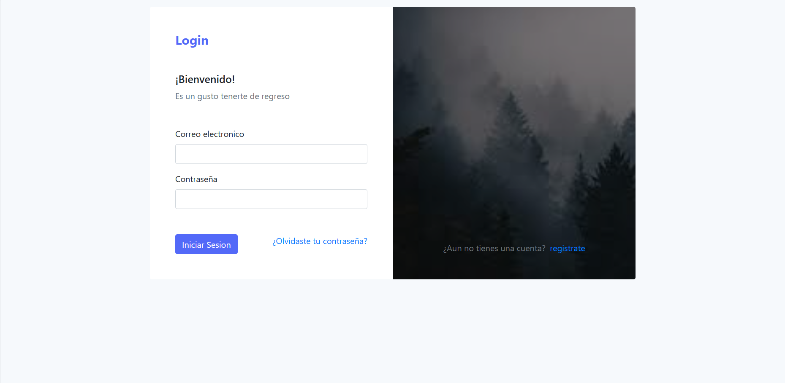

# Plantilla HTML para Inicio de Sesión 05

Este repositorio contiene una plantilla HTML para una página de inicio de sesión elegante y receptiva. La plantilla utiliza Bootstrap 4 y estilos personalizados para crear una interfaz de inicio de sesión moderna. Siéntete libre de utilizar y modificar esta plantilla para tus proyectos.

## Vista Previa



## Características

- **Diseño Responsivo:** La página de inicio de sesión está diseñada para ser receptiva y funcionar bien en varios dispositivos.
- **Interfaz con Estilo:** El uso de Bootstrap y estilos personalizados proporciona una experiencia de inicio de sesión moderna y visualmente atractiva.
- **Enlace de Olvidaste tu Contraseña:** Los usuarios pueden acceder fácilmente a la función de olvido de contraseña a través de un enlace proporcionado.
- **Registro de Cuenta:** La plantilla incluye un enlace para registrarse y crear una nueva cuenta.

## Cómo Utilizar

1. Clona el repositorio en tu máquina local:

   ```bash
   git clone https://github.com/tu-nombre-de-usuario/tu-repo.git
   ```

2. Abre el archivo `index.html` en tu editor de código preferido.

3. Personaliza el contenido y los estilos según los requisitos de tu proyecto.

4. Aloja el archivo HTML en un servidor web o intégralo en tu aplicación web.

## Dependencias

- [Bootstrap 4](https://getbootstrap.com/)
- [Font Awesome](https://fontawesome.com/)

## Contribuciones

Si encuentras algún problema o tienes sugerencias de mejora, no dudes en abrir un problema o crear una solicitud de extracción.

## Licencia

Este proyecto está bajo la Licencia MIT. Consulta el archivo [LICENSE](LICENSE) para obtener más detalles.

